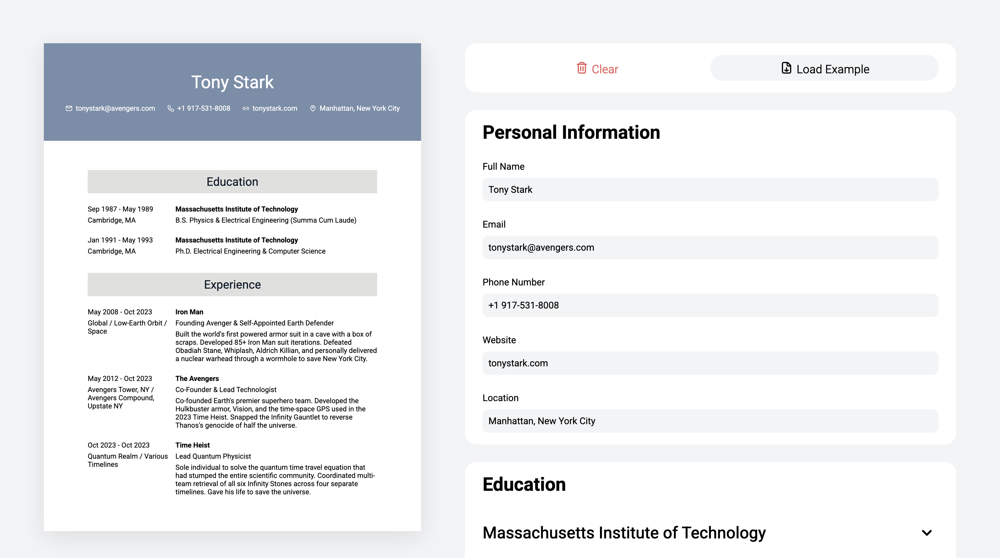

# ResumeBuilder

A live, interactive resume builder that lets you fill in your details and see the formatted CV update in real time.

🔗 **[Live Demo](https://aaronxyzheng.github.io/resume-builder/)**



---

## Tech Stack


## Features

- **Live preview** — the resume updates instantly as you type
- **Education & Experience sections** — add as many entries as you need, each collapsible via an accordion
- **Load example** — one click to populate the form with sample data
- **Clear** — reset everything back to a blank slate
- **Responsive paper layout** — the resume preview is sized to match a real 8.5×11 sheet

## What I Learned

This was my first React project. Key concepts I picked up:

- **Controlled components** — driving all inputs from React state rather than the DOM
- **Lifting state up** — keeping the single source of truth in a top-level custom hook (`useResumeState`) and passing updater functions down as props
- **Component composition** — splitting the UI into small, focused components (`Dropdown`, `SchoolInput`, `ExperienceInput`, etc.) that each own one responsibility
- **Custom hooks** — extracting all state logic out of `App` into `useResumeState` to keep components clean
- **Immutable state updates** — using spread and `.map()` to update nested arrays without mutating state directly

## Getting Started

```bash
git clone https://github.com/aaronxyzheng/odin-cv-application.git
cd odin-cv-application
npm install
npm run dev
```

Then open [http://localhost:5173](http://localhost:5173).

## Project Structure

```
src/
├── hooks/
│   └── useResumeState.js       # All state & update logic
├── utils/
│   ├── models.js               # createSchool / createExperience factories
│   └── data.js                 # getEmptyInfo / getExampleInfo
└── components/
    ├── Resume.jsx              # Live resume preview
    ├── ResumeBuilder.jsx       # Editor panel
    ├── resume/                 # Header, Education, Experience display
    └── resume-builder/         # Form inputs, Dropdown accordion, buttons
```

---

> Part of [The Odin Project](https://www.theodinproject.com/) curriculum.
